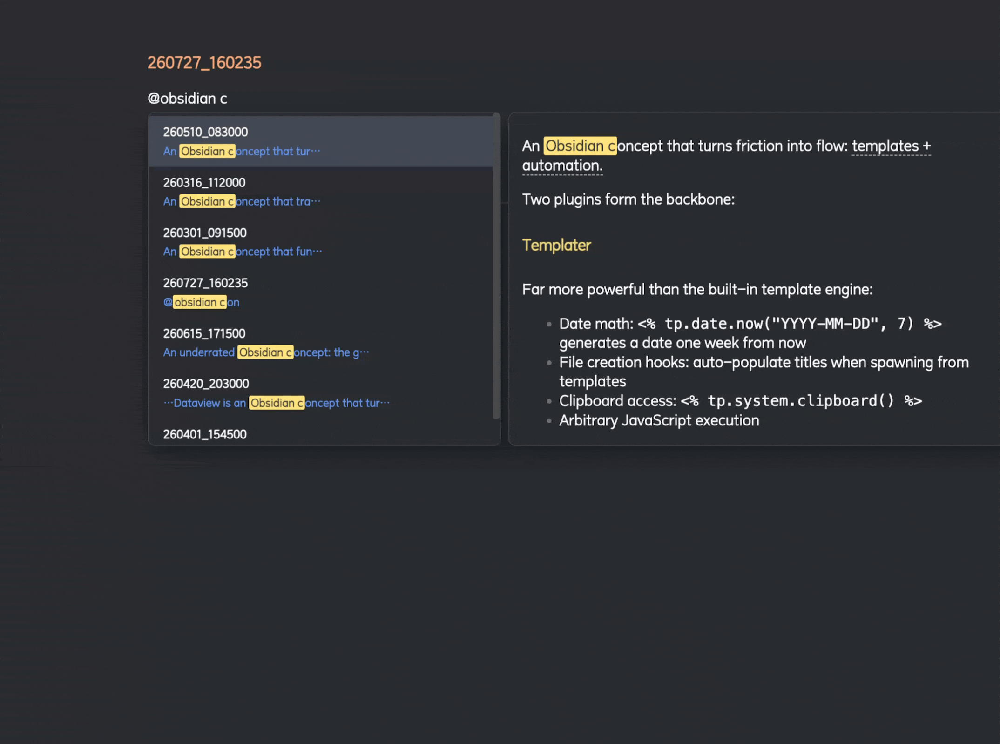

# Obsidian @ Mention Autocomplete

Type `@` to instantly search and link any note in your vault — with full-text search, rendered preview, and smart sentence extraction.

## Why

Obsidian's built-in `[[` autocomplete only matches note **titles**. When you have hundreds of timestamped notes (`250727_095442.md`), finding the right one by title is impossible. You need to search by **content** — "which note was I talking about 早睡 in?"

`@mention` lets you type `@早睡` and immediately see every note that mentions it, with the exact matching sentence highlighted, and the full note rendered in a side panel.

## Features

- **Full-text search** across all markdown files (strips YAML frontmatter, indexes content)
- **`@` trigger** — type `@keyword` anywhere in a note to see matches
- **Rendered detail panel** — hover or keyboard-navigate to see the full note body with markdown rendering
- **Keyword highlighting** — bright yellow highlights in both the suggestion list and detail panel
- **Smart alias extraction** — inserts `[[note#heading|matching sentence]]` bounded by sentence terminators
- **IME-aware** — correctly handles Chinese pinyin input; Enter confirms characters, then selects
- **Keyboard-first** — `↑↓` / `Ctrl+N` `Ctrl+P` to navigate, `Enter` to select, `Esc` to dismiss
- **Click outside to dismiss**
- **Live index** — automatically updates as you create, edit, rename, or delete notes

## Usage

1. Type `@` followed by any keyword
2. Navigate results with arrow keys or mouse
3. Press `Enter` to insert a wikilink — the alias auto-selects for quick editing

## Install

### From Obsidian Community Plugins
Search for "Mention Autocomplete" in Settings → Community Plugins → Browse.

### Manual
Copy `main.js`, `manifest.json`, and `styles.css` into `.obsidian/plugins/at-mention-autocomplete/`.

## Performance

Indexes are built in-memory at startup. For vaults with 10,000+ notes, initial indexing takes ~1-2 seconds. Subsequent searches are instant (O(n) substring match with scoring). File changes are debounced and incrementally updated.

## License

MIT
